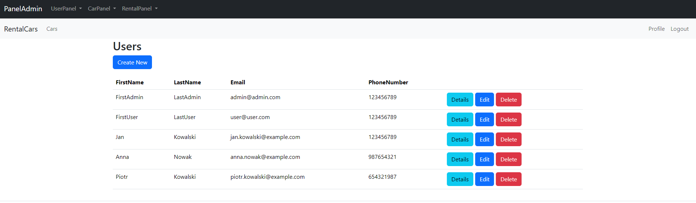
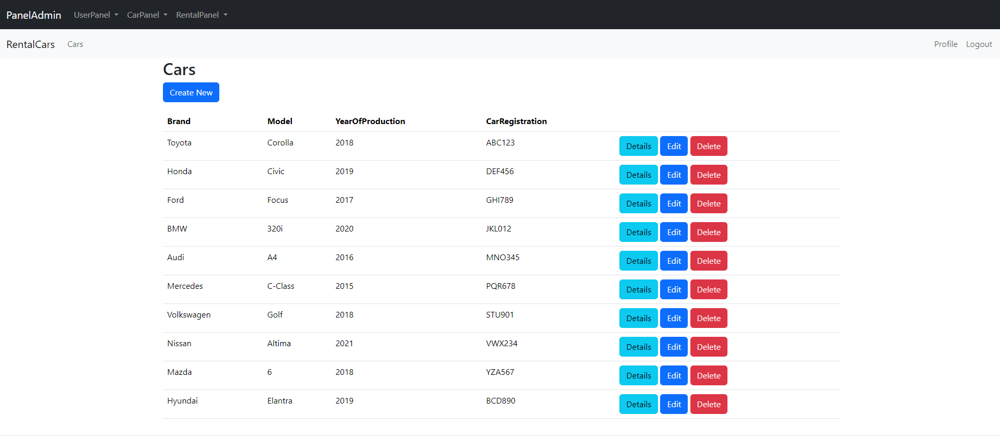
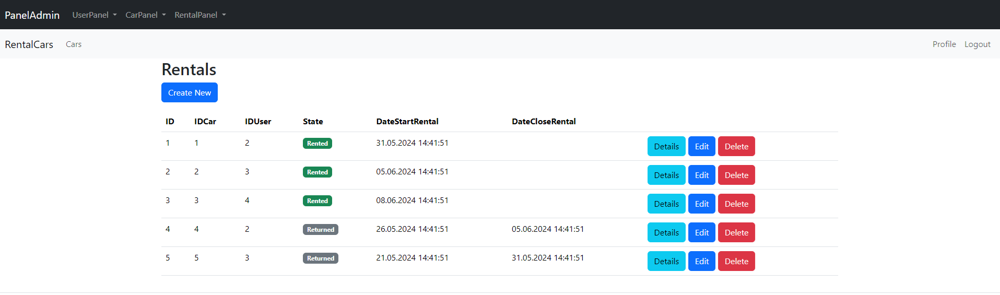
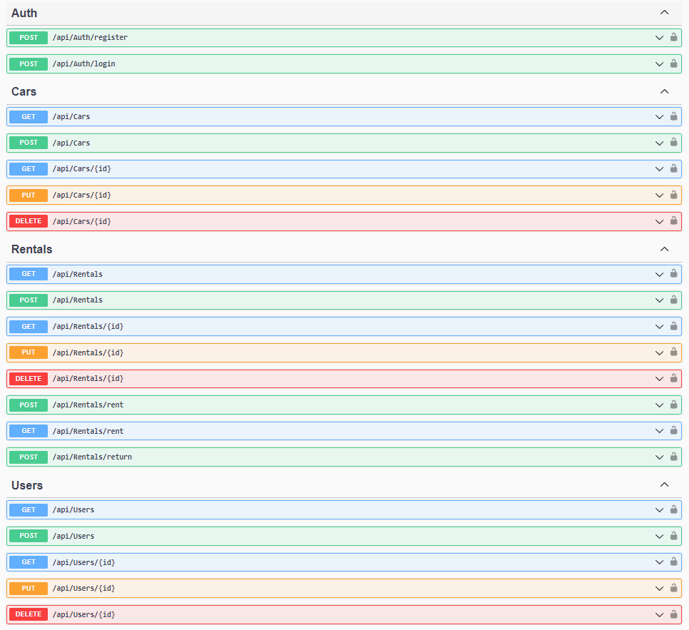

# BackEnd-Labs-2024

The "Studia-Labs-2024" solution consists of projects for API handling:

- **Labs2024-API**: webapi requests and responses
- **Labs2024-Application**: application logic
- **Labs2024-Domain**: core domain models
- **Labs2024-GraphQL1**: GraphQL try implementation
- **Labs2024-Infrastructure**: infrastructure for repositories, database
- **Labs2024-UnitTests**: unit testing
- **Labs2024-WebPages**: panel admin pages

**Additional Files:**

- **api-tests-admin.http**: file for testing admin api 
- **api-tests-user.http**: file for testing user api 

## How to run the application:

1. **Install** the necessary **packages**
2. **Initialize the database** using the project **Labs2024_Infrastructure**:
    ```bash
    cd Labs2024_Infrastructure
    dotnet ef migrations add initdb
    dotnet ef database update
    ```
3. Run the **Labs2024_API** backend logic project:
    ```bash
    cd Labs2024_API
    dotnet run
    ```
4. Run the **Labs2024_WebPages** UI project:
    ```bash
    cd Labs2024_WebPages
    dotnet run
    ```

**Login details for:**

**Admin:**
- **Login:** admin
- **Password:** admin123!

**User:**
- **Login:** user
- **Password:** user123!

### The project is an imitation of a car rental company.



### API Swagger

